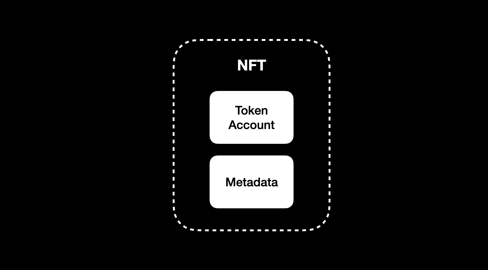
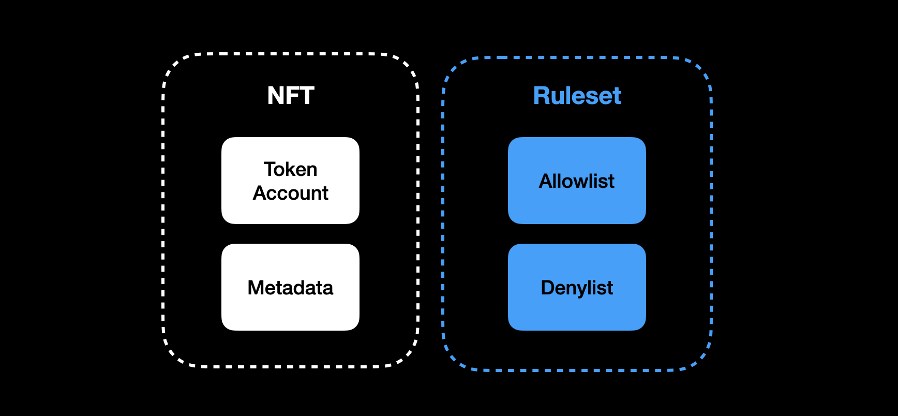
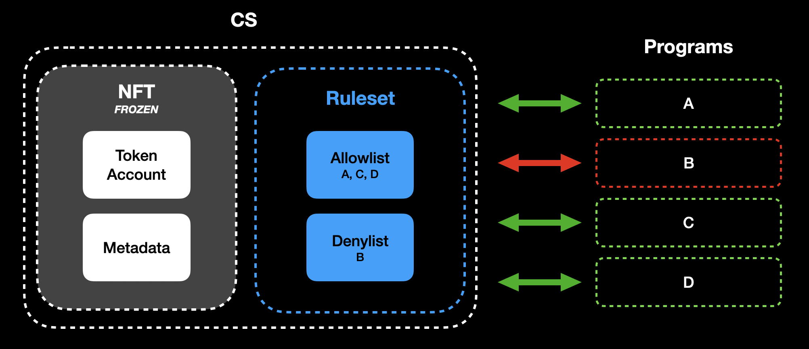
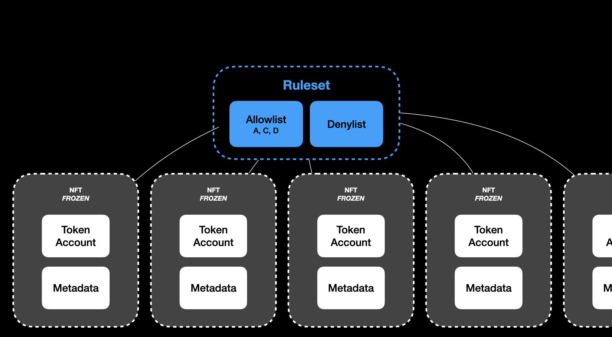
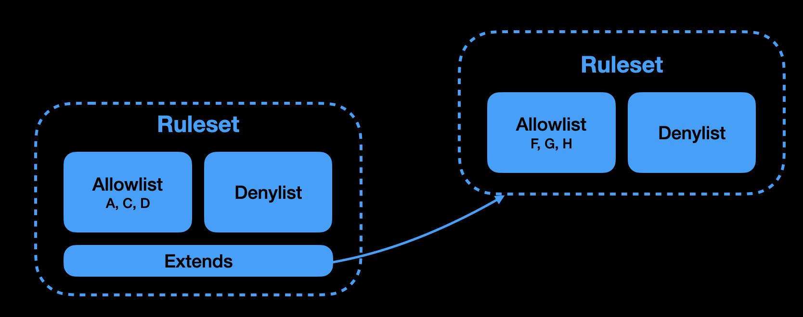

# Cardinal Creator Standard

<div style="text-align: center; width: 100%;">
  
</div>

## Read the [GitBook](https://docs.cardinal.so/the-creator-standard/summary)

> Contains the entire end-to-end proposal that includes background, proposed solution, pricing and examples of technical integration.

# Background

The Creator Standard is a smart contract-level solution to the issue of royalty circumvention that allows creators to decide with which programs their NFTs can interact without sacrificing basic wallet-to-wallet transfers.

The protocol, which is built on top of the SPL token program, selectively permissions token transfers to achieve this. Every token has an associated Mint Manager account, which holds its freeze and mint authority. Each mint manager specifies a ruleset, which is simply a set of "rules" (allowlist/denylist) that dictates which programs can interact with and transfer the NFT. The ruleset is assigned by the NFT's creator and can be updated at their discretion.

# Basic NFT

<div style="text-align: center; width: 100%;">
  
</div>

# NFT with Attached Ruleset

<div style="text-align: center; width: 100%;">
  
</div>

# NFT Ruleset Program Interaction

<div style="text-align: center; width: 100%;">
  
</div>

# Rulesets Can Be 1:Many with NFTs

<div style="text-align: center; width: 100%;">
  
</div>

# Rulesets Can Extend Other Rulesets

<div style="text-align: center; width: 100%;">
  
</div>

# Program State

The program utilizes two types of program derived accounts.

### Ruleset

<aside>
📖 Set of rules that permission the transfer of a token specified by the token’s creator

</aside>

```rust
let mut seeds = ['ruleset'.as_bytes(), name.as_bytes()];
pub struct Ruleset {
    // account discriminator
    pub account_type: u8,
    // version for potential future versioning
    pub version: u8,
    // authority who can update this ruleset
    pub authority: Pubkey,
    // name for this ruleset (also used to derive ruleset address)
    pub name: String,
    // vector of allowed programs that can interact with this nft
    pub allowed_programs: Vec<Pubkey>,
    // vector of disallowed addresses that cannot interact with this nft
    pub disallowed_addresses: Vec<Pubkey>,
}
```

### Mint Manager

<aside>
📖 One-to-one relationship with a token’s mint. A token minted implementing CCS has a respective mint manager that holds its mint and freeze authority. An already existing toke can implement CSS by surrendering its aforementioned authorities.

</aside>

```rust
let mut seeds = ['mint-manager'.as_bytes(), mint.as_ref()];
pub struct MintManager {
  // account discriminator
  pub account_type: u8,
  // version for potential future versioning
  pub version: u8,
  // mint address of this NFT that this mint-manager corresponds to
  pub mint: Pubkey,
  // authority who can update the ruleset of this mint-manager
  pub authority: Pubkey,
  // ruleset to be checked when transferring
  pub ruleset: Pubkey,
  // optional address currently using this NFT meaning it cannot be transferred while in-use
  pub in_use_by: Option<Pubkey>,
}
```

When a mint manager gets created for a mint, the mint manager freezes the mint perpetually. Each mint manager is associated with a ruleset, with it specifying specific a set of rules

Most fields are self-explanatory with the exception of `in_use_by` field which needs some underlying context and will be discussed below.
